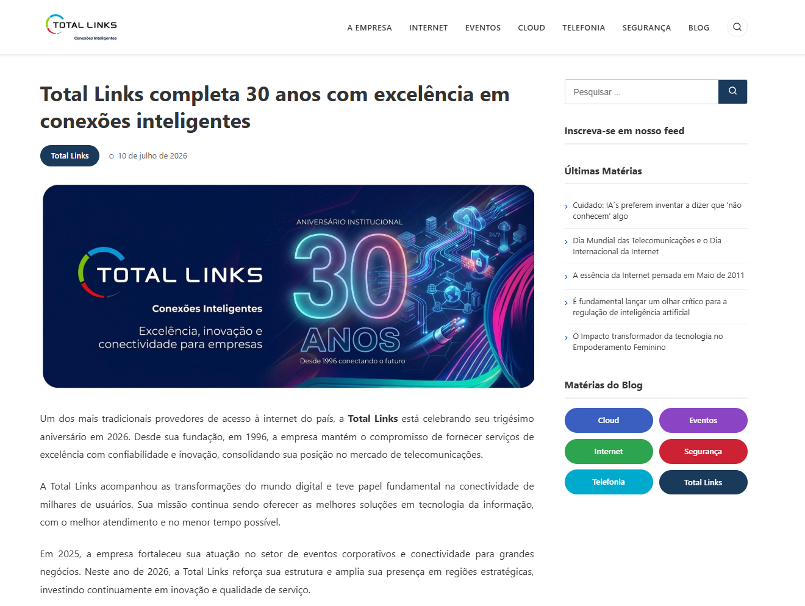

# 🎉 Total Links - 30 anos

Landing page desenvolvida como estudo para celebrar os **30 anos** da Total Links (1996 - 2026).

## 🚀 Tecnologias utilizadas

- HTML5 semântico
- CSS3 (Flexbox, Grid, variáveis, animações)
- Design responsivo (Mobile First)

## 🔧 Como visualizar

1. Clone o repositório:
```bash
git clone https://github.com/Erisksnt/Blog-Total.git
```

2. Abra o arquivo total-links-landing.html no navegador

## 📸 Preview


